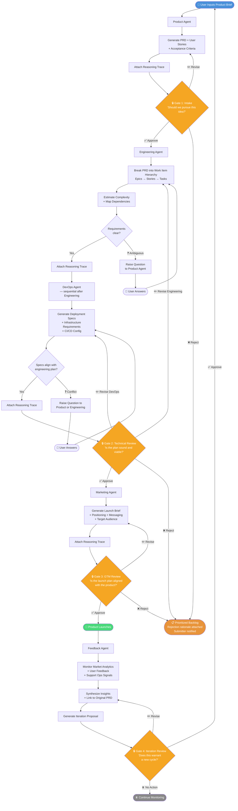
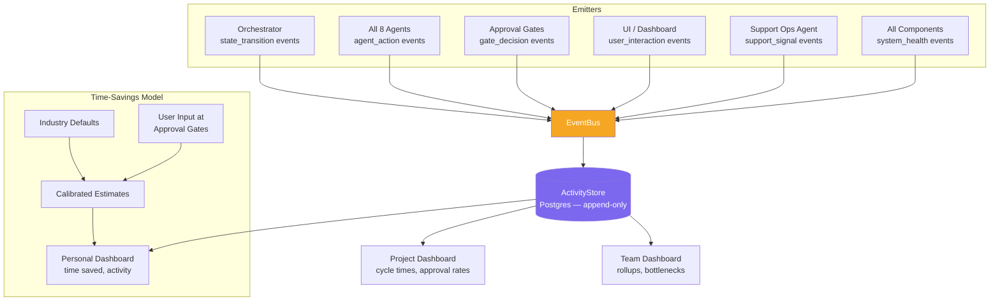
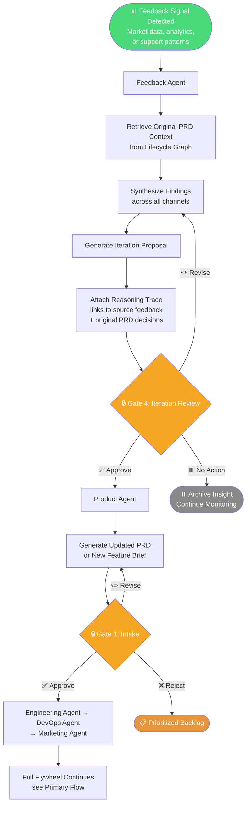
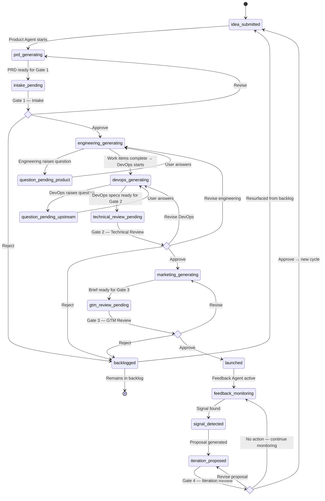
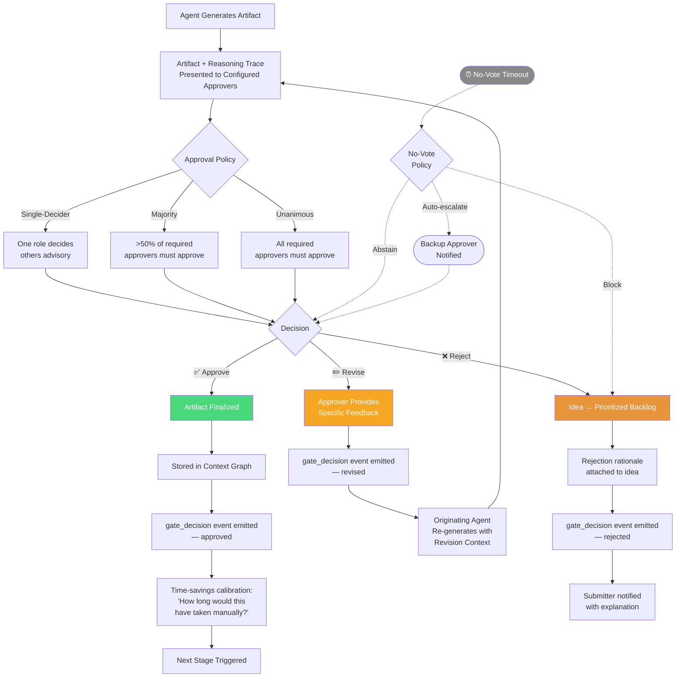

# POEM User Flow Diagrams

**For PRD Section 2: Solution Definition**  
**Version:** 2.1 (aligned with PRD v1.3)  
**Date:** February 2026

---

## 1. Primary Flow: Full Flywheel (Idea → Launch → Iteration)



---

## 2. Context Flow: What Gets Stored and Retrieved

```mermaid
flowchart LR
    subgraph Context Graph — pgvector
        CG[(Lifecycle\nContext Graph)]
    end

    PA[Product Agent] -->|WRITE: PRD decisions,\nuser stories, rationale| CG
    EA[Engineering Agent] -->|WRITE: work items,\ncomplexity estimates,\ndependencies| CG
    DA[DevOps Agent] -->|WRITE: infra specs,\ndeployment decisions| CG
    MA[Marketing Agent] -->|WRITE: positioning,\nmessaging decisions| CG
    FA[Feedback Agent] -->|WRITE: insights,\nsignal interpretations| CG
    SO[Support Ops Agent] -->|WRITE: classified signals,\npattern data| CG
    SE[Service Eng Agent] -->|WRITE: root cause\nanalysis, repro steps| CG

    CG -->|READ: PRD context| EA
    CG -->|READ: PRD + engineering plan| DA
    CG -->|READ: all upstream context| MA
    CG -->|READ: full lifecycle context\n+ support signals| FA
    CG -->|READ: feedback + original PRD| PA
    CG -->|READ: product context\nfor classification| SO
    CG -->|READ: engineering context\nfor investigation| SE

    style CG fill:#7B68EE,color:#fff
```

---

## 3. Telemetry Flow: EventBus + ActivityStore



---

## 4. Secondary Flow: Feedback-Triggered Iteration



---

## 5. Tertiary Flow: Support Operations Signal Processing

```mermaid
flowchart TD
    A([📨 Support Ticket / Bug Report\n/ Customer Complaint]) --> B[Support Ops Agent]
    B --> B1[Classify Signal]

    B1 --> C{Classification}

    C -->|🐛 Bug| D[Service Engineering Agent]
    D --> D1[Investigate + Reproduce]
    D1 --> D2[Root Cause Analysis\n+ Severity Assessment]
    D2 --> D3{Confirmed Bug?}
    D3 -->|Yes| D4[Route to Engineering Agent\nwith repro steps + root cause]
    D3 -->|No — actually UX confusion| E1

    C -->|💡 Feature Request| E[Enrich with Frequency\n+ User Context]
    E --> E2[Route to Feedback Agent\nfor synthesis with\nother signals]

    C -->|😕 UX Confusion| E1[Tag with User Journey Context]
    E1 --> E1a[Route to Product Agent\nfor UX rethink]
    E1 --> E1b[Route to Engineering Agent\nfor implementation assessment]

    D4 --> FA[Feedback Agent\nPattern Detection]
    E2 --> FA
    E1a --> FA
    E1b --> FA

    FA --> FA1[Aggregate patterns:\n'20 users hit same\nUX confusion this week']
    FA1 --> FA2[Feed into Iteration Proposal\nat Gate 4]

    subgraph Human Override — Available at Any Point
        HO([👤 Reclassify Signal])
    end
    B1 -.->|Override| HO
    HO -.->|Corrected classification| C

    style A fill:#4A90D9,color:#fff
    style D4 fill:#D94A4A,color:#fff
    style E2 fill:#4AD97A,color:#fff
    style E1a fill:#F5A623,color:#fff
    style E1b fill:#F5A623,color:#fff
```

---

## 6. Orchestrator State Machine



---

## 7. Approval Gate Detail



---

## 8. Work Item Hierarchy

```mermaid
flowchart TD
    subgraph Generated by Product Agent
        IDEA([💡 Idea\nOriginal product concept\nfrom user input])
    end

    subgraph Generated by Engineering Agent — depth configurable
        IDEA --> EP1[📦 Epic\nMajor feature area]
        IDEA --> EP2[📦 Epic\nMajor feature area]

        EP1 --> ST1[📝 Story\nUser-facing value increment\n'As a user, I want...']
        EP1 --> ST2[📝 Story]
        EP2 --> ST3[📝 Story]

        ST1 --> TK1[🔧 Task\nImplementable unit\n3 story points]
        ST1 --> TK2[🔧 Task\n2 story points]
        ST2 --> TK3[🔧 Task\n5 story points]
        ST3 --> TK4[🔧 Task\n1 story point]
        ST3 --> TK5[🔧 Task\n3 story points]
    end

    subgraph Configurable Depth
        M1[Minimal — solo founder\nIdea → Tasks]
        M2[Standard — small team\nIdea → Epics → Stories → Tasks]
        M3[Expanded — larger teams\nIdea → Themes → Epics → Stories → Sub-tasks]
    end

    TK1 -.->|dependency| TK3
    TK4 -.->|dependency| TK2

    style IDEA fill:#4A90D9,color:#fff
    style EP1 fill:#7B68EE,color:#fff
    style EP2 fill:#7B68EE,color:#fff
    style ST1 fill:#4AD97A,color:#fff
    style ST2 fill:#4AD97A,color:#fff
    style ST3 fill:#4AD97A,color:#fff
    style M1 fill:#eee,color:#333
    style M2 fill:#eee,color:#333
    style M3 fill:#eee,color:#333
```

---

## 9. Agent Roles & Ownership Map

```mermaid
flowchart LR
    subgraph WHAT & WHY
        PA[🎯 Product Agent\nProduct Manager\n— PRDs, user stories,\nprioritization]
    end

    subgraph HOW — Technical
        EA[⚙️ Engineering Agent\nTech Lead\n— work items, complexity,\ntechnical approach]
    end

    subgraph WHERE — Infrastructure
        DA[🚀 DevOps Agent\nDevOps Engineer\n— deploy configs, CI/CD,\ninfra specs, monitoring]
    end

    subgraph HOW — Go-to-Market
        MA[📣 Marketing Agent\nProduct Marketing Mgr\n— positioning, messaging,\nlaunch briefs]
    end

    subgraph LEARN & ITERATE
        FA[📊 Feedback Agent\nProduct Analyst\n— signal synthesis,\niteration proposals]
    end

    subgraph SUPPORT OPERATIONS
        SO[📞 Support Ops Agent\nSupport Ops Manager\n— classify & route:\nbug / feature / UX confusion]
        SE[🔍 Service Eng Agent\nSupport Engineer\n— investigate, reproduce,\nroot cause analysis]
    end

    PA -->|approved PRD| EA
    EA -->|engineering plan| DA
    PA -->|approved PRD| MA
    EA -.->|❓ question| PA
    DA -.->|❓ question| PA
    DA -.->|❓ question| EA
    SO -->|bugs + context| SE
    SE -->|enriched bugs| EA
    SO -->|feature requests| FA
    SO -->|UX confusion| PA
    SO -->|UX confusion| EA
    FA -->|iteration proposal| PA

    style PA fill:#4A90D9,color:#fff
    style EA fill:#7B68EE,color:#fff
    style DA fill:#4AD97A,color:#fff
    style MA fill:#F5A623,color:#fff
    style FA fill:#E8943A,color:#fff
    style SO fill:#D94A8A,color:#fff
    style SE fill:#D94A8A,color:#fff
```

---

*These diagrams render in any Mermaid-compatible viewer: GitHub (natively), VS Code with Mermaid extension, or [mermaid.live](https://mermaid.live) for preview.*
